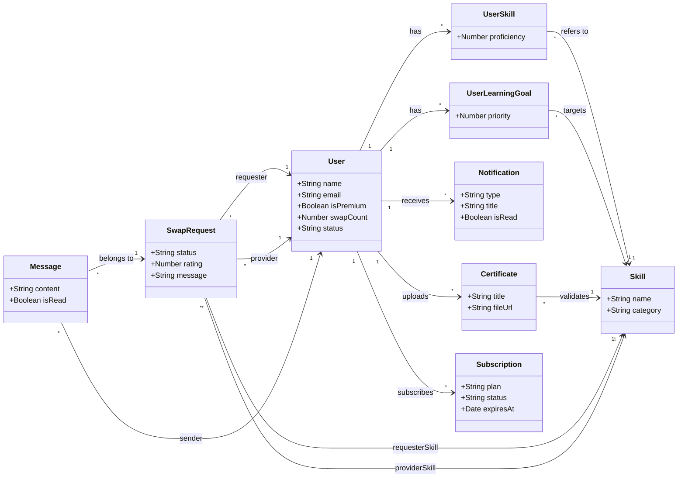

# Simplified Swapify Core Architecture

Here is the simplified UML Class Diagram tailored for a presentation slide. It focuses exclusively on the core domain entities and their primary relationships, omitting DTOs, controllers, services, and boilerplate fields (like `id`, `createdAt`) to keep it clean and highly readable.

